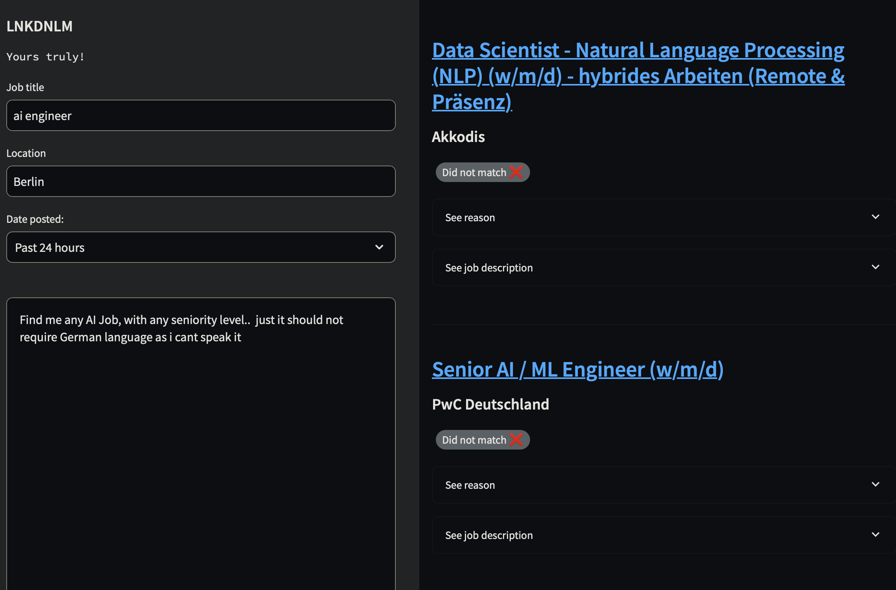

# lnkdnlm
A Project which dreams to streamline job searching using open source llms on your PC!
In heavy development these day. Follow the repository and Keep in touch.

Screenshot:



## Prerequisites
* Python >= 3.7, you can use for example [pyenv](https://github.com/pyenv/pyenv#installation) to manage that
* [Poetry](https://python-poetry.org/docs/#installation)

## Installing dependencies
```bash
make install
```

## Tests and checks
To run all tests and checks:
```bash
make check
```

To run all tests (unit and integration):
```bash
make test
```

### unit-tests
To just run unit-tests:
```bash
make unit-test
```

### integration-tests
To just run integration-tests:
```bash
make integration-test
```

### Auto-formatting
```bash
make auto-format
```

### Linting
```bash
make lint
```

### Check types
```bash
make type-check
```
